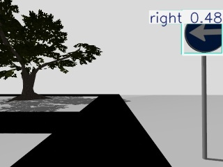
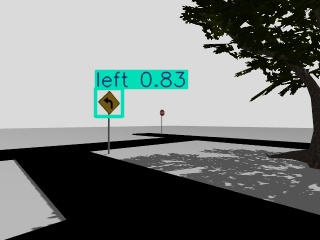
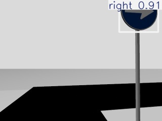
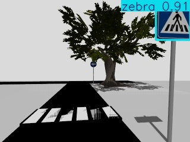
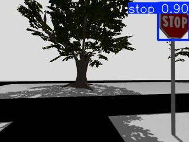

# Közúti tábla detektálása Gazebo világban turtlebot3-al
Projektfeladatunk a BME Kognitiv Robotika tárgy keretében a következő volt:
Gazebo szimulációs környezetben TurtleBot3 segítségével közlekedési táblákat kellett felismerni és azok alapján a megfelelő akciót végrehajtani.

[👉 Nézd meg a videót a YouTube-on](https://www.youtube.com/watch?v=Yc2gTMmYv5w)


## A projekt elkészítésében részt vettek:
- Rátkai Bálint (DSPQKJ)
- Veres András Jenő (A7FOV4)
- Kis-Tamás Levente (N1LVWX)

## A Projekt elkészítése
Az órai előadásokon elhangzottak és a kiadott anyagok alapján indultunk el. 
### A világ megalkotása
Mivel közlekedési tábla felismerés volt a feladatunk, ezért egy annak megfelelő világ létrehozása volt a cél. Kezdetben más, már létező világokat kerestünk az interneten. Találtunk is, de nem tudtuk megfelelően beimportálni a szükséges modelleket és textúrákat. Ezért, úgy döntöttünk, hogy nulláról kezdjük és elkészítünk egy saját világot.
Az utakat téglalapokként helyeztük el a ground plane-n, majd a Gazebo saját könyvtárából fákat helyeztünk el a színesebb környezet érdekében. Ezekután táblákra volt szükségünk, mint feladatunk központi elemére. Az interneten talált modellek nem voltak megfelelőek számunkra, ezért Blender környezetben modelleztünk saját táblákat. Az elkészített modellek megtalálhatóak a models mappában. Végül a táblákat elhelyeztük a világban.

### Táblakészítés blenderben
A táblákat egy kész csomag részeként szereztük be, amely az alábbi linken érhető el:
https://andrew-d.gumroad.com/l/bbAKE

Innen Blender 3-ban kiválaszottuk a számunkra szükséges táblákat, majd ezeket egy táblaoszlopra helyezve exportáltuk azokat textúrával együtt.


A balra táblát végül lecseréltük egy szögletes alapúra, ehhez a texture paint fülön a textúra kimentése után Gimppel átfestetük a .png fájlt, amelyet újra beolvasva már a megfelelő kinézettel tudtuk exportálni a táblát.

Exportálás során a következőkre kell figyelni:
- A tábla és a tábla-oszlop legyen kijelölve a világban, más viszont ne.
- A tábla a világ origójában legyen, különben Gazeboban is ugyanannyival el lesz tolva.
Ez után exportálhatjuk egy külön mappába: File -> Export -> Collada (.dae), pipáljuk be a Selection only és az UV opciókat, adjunk egy értelmes nevet a file-nak, és hozzunk létre neki egy almappát!


Ez létrehozza a .dae filet, és mellé elmenti a textúrát is. Helyezzük ezeket egy "meshes" nevű almappába, majd másoljuk a meshes mappa mellé valamely kész modell model.config és model.sdf fájlját, a .sdf-ben módosítsuk a referenciákat az új modell .dae fájljára, illetve a .config-ban nevezzük át tetszőlegesen a modellünket a <name> paraméterrel (ez a név fog megjelenni Gazebo-ban).  

### A táblák és a hozzátartozó akciók
Az alábbi táblákat használtul fel (zárójelben az elvégezendő akció):

- Stop tábla: megáll a robot 
- Zebra tábla: lassít, megáll, körülnéz és elindul
- Jobbra tábla: jobbra fordul és elindul
- Balra tábla: balra fordul és elindul

A következő lépés a tanítás, de ezek előtt a robotunkon módosítani kellett pár paramétert.
### TurtleBot3 átalakítása
A MOGI csomag alapján használtuk a TurtleBot-ot, de szükséges volt pár paraméterének a megváltoztatására. Elsődlegesen a sebességét állítottuk át, mivel méretéből adódóan nagyon lassan haladt az eredeti sebességet használva. Ezért sikeresen felgyorsítottuk. Ezekmeleltt a roboton található kamerának paramétereit is meg kellett változtatnunk, Feljebb emeltük a kamerát, hogy a kamera kép tényleg egy autóéhoz hasonlítson. Figyeltünk a robot fizikai jellemzőire is, hogy ezek a változások ne "borítsák fel" a robotunkat.


#### A változtatások részletesebben:

A stabilitáshoz:
```
    <link name="base_link"> ...
      <inertial> ...
        <inertia>
          <ixx>0.023</ixx> <!-- 0.0023 helyett --> ...
          <iyy>0.023</iyy> <!-- 0.0023 helyett --> 
...
    <link name="wheel_left_link"> ...
      <collision name="wheel_left_collision"> ...
        <surface>
          <!-- This friction pamareter don't contain reliable data!! -->
          <friction>
            <ode>
              <mu>1</mu>
              <mu2>1</mu2>
```
ue. wheel_right_link-re

A kamera módosítása:
```
    <link name="camera_link">
      <inertial>
        <mass>0.0005</mass>   <!-- 0.05 helyett --> ...

      <pose>0.03 0 1 0 0 0</pose> ...

      <sensor name="camera" type="camera"> ...
        <camera name="intel_realsense_r200">
          <clip>
            <near>0.1</near>
            <far>150</far>
```

Max sebességhez:
```

    <joint name="wheel_left_joint" type="revolute"> ...
      <axis> ...
        <limit>
          <effort>100</effort>
          <velocity>100</velocity>
```
ue. wheel_right_joint-ra

Plugin a pocíció publikálására:
```
    <plugin name="gz::sim::systems::PosePublisher" filename="gz-sim-pose-publisher-system">
      <publish_link_pose>false</publish_link_pose>
      <publish_sensor_pose>false</publish_sensor_pose>
      <publish_model_pose>true</publish_model_pose>
      <publish_collision_pose>false</publish_collision_pose>
      <publish_visual_pose>false</publish_visual_pose>
      <publish_nested_model_pose>true</publish_nested_model_pose>
    </plugin>
```


### Tanítás YOLO-val
Hosszas ötletelés során az alábbi ötletre jutottunk:

 - A robotnak csak a kameráját használjuk a detektálásra.
 - Nem használunk LIDAR-t a távolság meghatározására, helyette bounding box mérete alapján végzi el a robot a feladatot
 - Ha elég nagy a felismert tábla bounding box-ja elvégzi az akciót
 - A tanításhoz képeket mentünk ki a saját világunkból
 - Plusz képeket gyűjtünk be az internetről
 - YOLO segítségével végezzük a tanítást

A tanítást úgy láttuk a legjobbnak, hogy nem wsl2-n futtatjuk, hanem Windows alatt és ha kész a tanulás utána ültetjük át a végeredményt.
Első megoldások esetében, a YOLOv8 alacsonyabb modelljeit használtuk. Azt vettük észre, hogy a tábla felismeréskor a BALRA táblát is JOBBRA táblának detektálja. Nem volt elegendő képünk ennek kiküszöbölésére. Nagyon hasonló a két tábla ezért úgy döntöttünk másra cseréljük a BALRA táblát.




### Tesztelés
A végleges modellünk a YOLO8 medium verziója. Először Windowson kimentett képeken néztük meg az eredményeket. 






Az eredményeket látva, tovább léphettünk a WSL2 környezetbe átimportálásra.
#### Tesztelés wsl2-ben

### Összegzés és fejlesztési javaslatok
A projektfeladat elkészítése során számos problémába ütköztünk, de többségére mind találtunk megoldást. Hátráltatott minket a lassú környezet (GPU-t nem tudtuk használni) és sok tárhelyre is volt szükségünk.
Az robot nem automatán megy, távirányító segítségével tudjuk irányítani.
Elsajátítottuk a github kezelését, wsl2-ben használt utasításokat, gazebo világ építésést, saját ROS2 nodeírásokat. Összességében a projekt feladatunk képes táblák detektálására szimulációban a turtlebot3 segítségével real time.

A projektfeladat tovább fejleszthető egy erősebb tanítási modellel és nagyobb adatbázissal. A mi megoldásunkban csak kameraképet hasznátunk. LIDAR segítségével komplexebb detektálás is végrehajtható az időben. Mint például gyalogosok a zebrán, más autók távolsága. Illetve automatizálható.
# A szimuláció elindítása
Készíts egy workspace mappát és azonbelül egy source mappát. Majd klónozd le a git repo-t.

```
mkdir -p ~/workspace/src
cd workspace/src
```

# Indítsd el a szimulációt!
Ez elindítja a GAZEBO szimulációt!
```
ros2 launch turtlebot3_gazebo turtlebot3_world.launch.py
```

## Szerkeszd a .bashrc file-t!
Ahhoz hogy működjön és megtalálja az elérési útvonalat szerkesztened kell a .bashrch filet!
```
source /opt/ros/jazzy/setup.bash
source ~/workspace/install/setup.bash

export TURTLEBOT3_MODEL=burger

export GZ_SIM_RESOURCE_PATH=~/workspace/src/ros2-traffic-project/models

export GAZEBO_MODEL_PATH=$GAZEBO_MODEL_PATH:~/workspace/src/ros2-traffic-project/models
```

# Indítsd el a távirányítót

Egy új console-ban:
```
ros2 run teleop_twist_keyboard teleop_twist_keyboard
```
Ezzel irányítható a turtlebot.
A robot max. sebessége feljebb lett véve, de a távirányító indítás után nem küld ehhez megfelelő parancsot: spameljük kicsit a 'q' billentyűt, kb. amíg a max sebesség el nem éri a 2-t.


# YOLO node indítása

A YOLO futtatásához hozzunk létre egy virtuális környezetet az alábbi útmutató szerint:
https://github.com/MOGI-ROS/Week-1-8-Cognitive-robotics/tree/main?tab=readme-ov-file#setting-up-a-python-virtual-environment

A virtuális környezetben telepítsük az ultralytics-et, és a többi szükséges könyvtárat:
```
pip install ultralytics 
```
...

A szükséges könyvtárak telepítése után a virtuális könyvtárból indítható a yolo node,
ebben a console ablakban futtassuk az alábbi parancsot, hogy a virtuális könyvár-beli python fusson:
```
export PYTHONPATH=$PYTHONPATH:/home/felhasznalo/.virtualenvs/tf/lib/python3.12/site-packages
```
Másold az src mappába a best.pt filet
```
cp /home/felhasznalo/workspace/src/ros2-traffic-project/traffic-sign-v11/weights/best.pt ~/workspace/src
```
Majd indítsuk a yolo node-ot!
```
ros2 run yolo_node yolo_gpt
```

# Megjelenítés

A megjelenítéshez indítsunk egy rviz2 ablakot:
```
rviz2
```
Bal alul az "add" gombra kattintva a "by topic" fülön válasszuk ki a /ultralytics/detection/image opciót.


